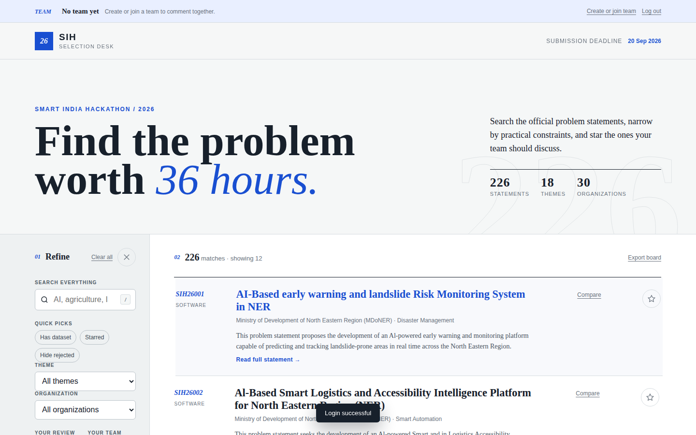
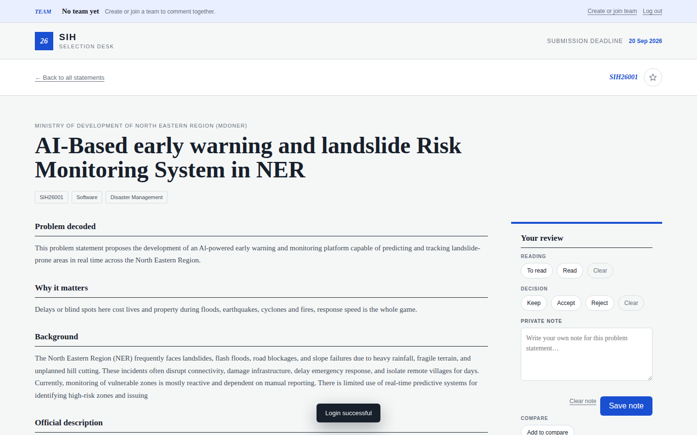
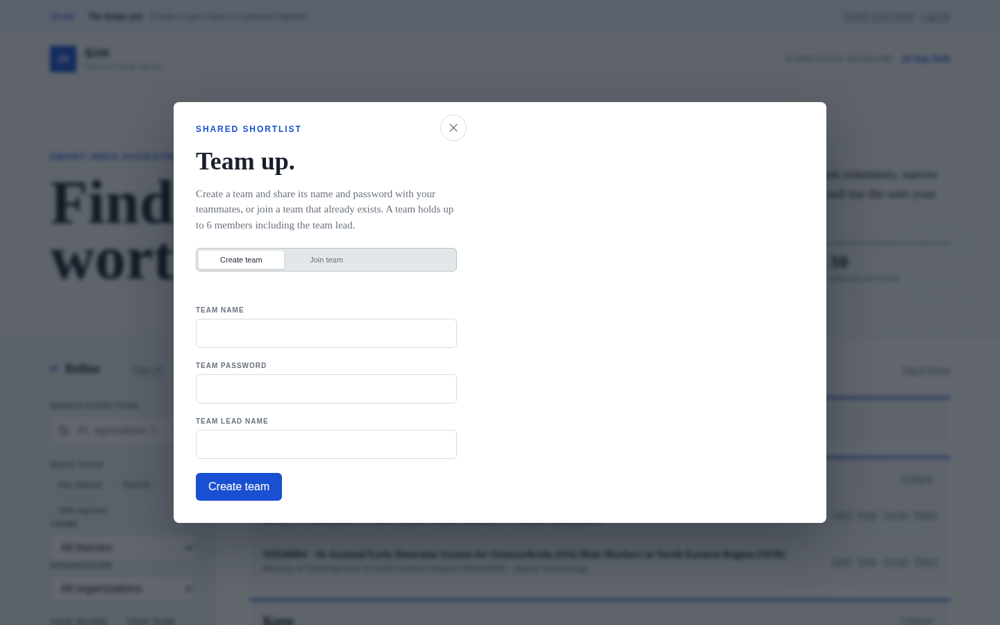
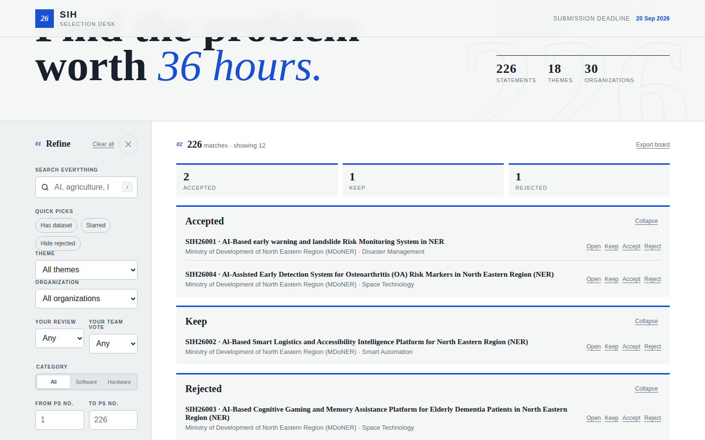

<div align="center">

# SIH Selection Desk

### Private, team-oriented browser for Smart India Hackathon 2026 problem statements

A Vercel-hosted problem-statement desk with Supabase email/password Auth, rotating
refresh tokens, server-side filtering, pagination, Supabase Postgres storage,
six-member teams, and private per-team comments.

[](LICENSE)
[](https://github.com/DeadIndian/sih-ps/stargazers)
[](CONTRIBUTING.md)


[Getting Started](#-installation) ·
[Architecture](docs/ARCHITECTURE.md) ·
[Report Bug](https://github.com/DeadIndian/sih-ps/issues) ·
[Request Feature](https://github.com/DeadIndian/sih-ps/issues)


</div>

---

## 📖 Table of Contents

- [Features](#-features)
- [Screenshots](#-screenshots)
- [Installation](#-installation)
- [Usage](#-usage)
- [Configuration](#-configuration)
- [Deployment](#-deployment)
- [Security Model](#-security-model)
- [Contributing](#-contributing)
- [License](#-license)

---

## ✨ Features

- **Problem statement browser** — paginated server-side list (12 per page) with full-text search accepting both `SIH26011` and `26011` forms
- **Filters** — theme, organization, category, dataset availability, starred items, hidden rejected items, serial-number range, quick picks
- **Full statement view** — summary, background, verbatim official description, expected-solution bullets, pain points, competitive landscape, 36-hour build plan, evaluator questions, scorecard, SWOT, dataset link
- **Six-member teams** — create or join with name + password, seat 1 is the lead, automatic lead succession, one team per user
- **Reviews** — private per-problem reading state (`to read` / `read`), decision (`keep` / `accept` / `reject`), private note (4000 chars), team votes (`yes` / `maybe` / `no`) with live totals
- **Review board** — status-grouped board, card badges, summary bar, compare up to 4 statements, markdown export
- **Private per-team comments** — visible only to the joined team
- **Hardened session handling** — Supabase Auth with rotating refresh tokens, hashed at rest, bound to IP hash + user agent

## 📸 Screenshots

| Statement list | Full statement view |
| :---: | :---: |
|  |  |

| Team dialog | Review board |
| :---: | :---: |
|  |  |

## 🚀 Installation

> Prerequisites: Node.js ≥ 20, a Supabase project, and the `ps.json` problem
> statement data file (kept out of git — obtain it from a teammate).

```bash
git clone https://github.com/DeadIndian/sih-ps.git
cd sih-ps
npm install
```

### Import the data

1. Open your Supabase project and run [`supabase/schema.sql`](supabase/schema.sql) in **SQL Editor**.
2. In **Project Settings → Database**, copy the **Transaction pooler** connection string (port `6543`).
3. Create a local `.env` from [`.env.example`](.env.example) and set `DATABASE_URL`.
4. Place `ps.json` in the repo root — it is already excluded by `.gitignore`.
5. Run:

```bash
npm run import:data
```

The import applies the schema and uploads all records as private Postgres rows. After a successful import, `ps.json` is never needed by Vercel.

### Configure Supabase Auth

1. In **Authentication → Providers**, enable **Email**.
2. Disable **Anonymous Sign-Ins** — the app rejects anonymous tokens.
3. Decide on **Confirm email**:
   - **Off** (fastest for a hackathon): signup returns a session and the user lands on the desk immediately.
   - **On**: signup returns `202` and the UI asks the user to confirm, then log in. Both paths are handled.
4. In **Authentication → Bot and Abuse Protection**, leave CAPTCHA **disabled** — the browser sends no captcha token, so an enabled CAPTCHA rejects every sign-in.

## 💻 Usage

```bash
node --env-file=.env scripts/dev.js   # http://localhost:3000
```

`scripts/dev.js` serves the static files and routes `/api/*` to the same handlers Vercel runs, including the `/problem-statements/:id` rewrite, and logs every API request with its status. It adds `http://localhost:3000` to `APP_ORIGIN` for the duration of the process so the origin check passes.

Run the offline checks:

```bash
node scripts/test-team.js
node scripts/checks/guards.mjs
BASE_URL=http://localhost:3000 node --env-file=.env scripts/checks/e2e-flow.mjs
```

### Routes

| Path | View |
| --- | --- |
| `/` | Login gate when signed out, statement list when signed in |
| `/problem-statements/SIH26011` | The complete problem statement |

`vercel.json` rewrites `/problem-statements/*` to the app shell. A signed-out visitor opening a statement URL directly sees the login screen; after signing in, that statement opens rather than the bare list.

## ⚙️ Configuration

| Variable | Description | Required |
| --- | --- | --- |
| `DATABASE_URL` | Supabase transaction pooler connection string (port 6543) | Yes |
| `SUPABASE_URL` | `https://<project-ref>.supabase.co` | Yes |
| `SUPABASE_PUBLISHABLE_KEY` | Supabase publishable key (server-side only) | Yes |
| `APP_ORIGIN` | Allowed origin(s), comma-separated | Production |
| `SUPABASE_DB_CA_CERT` | Absolute path to Supabase root CA cert | Production |
| `SUPABASE_DB_CA_CERT_PEM` | PEM contents of the CA cert (alternative to the above) | Production |

Production refuses to connect to Postgres without a verified CA. Keep any `service_role` or `sb_secret_*` key out of the browser, GitHub, and public Vercel variables.

## 🌐 Deployment

1. Push the project without `.env` and `ps.json` (`git ls-files ps.json` must print nothing).
2. Import the repository into Vercel.
3. Add all environment variables to Production and Preview environments.
4. Deploy and connect the custom domain.
5. Set `APP_ORIGIN` to the final domain, then redeploy.

### Put Cloudflare in front

Proxy the domain through Cloudflare with SSL/TLS mode **Full (strict)**. Minimum WAF rate-limit rules:

| Endpoint | Suggested limit | Action |
| --- | ---: | --- |
| `POST /api/auth` | 10 requests/IP/10 minutes | Managed Challenge |
| `POST /api/team` | 5 requests/IP/15 minutes | Block for 1 hour |
| `GET /api/problems/*` | 60 requests/IP/minute | Managed Challenge |
| `POST /api/comments*` | 10 requests/IP/minute | Block for 10 minutes |

Also enable Bot Fight Mode. Every route additionally rate-limits per account in Postgres, so changing IP alone does not bypass the limits.

## 🔒 Security Model

`ps.json` must never be deployed or committed. Browsers can only request:

- 12 summary records per list request
- One complete statement per detail request
- At most 60 distinct complete statements per seven-day account
- Comments belonging to the joined team

Every API route requires a verified Supabase access token; a logged-out caller gets `401` and no data. This slows and detects bulk collection but cannot make publicly displayed information impossible to copy — Cloudflare rate limits and bot management are still required in front of Vercel. Details on where enforcement lives, and why RLS is not the control here, are in [docs/ARCHITECTURE.md](docs/ARCHITECTURE.md#security-model).

## 🤝 Contributing

Contributions are welcome. Please read [CONTRIBUTING.md](CONTRIBUTING.md) and the [Code of Conduct](CODE_OF_CONDUCT.md) before opening a PR.

## 📄 License

Distributed under the MIT License. See [LICENSE](LICENSE) for details.

---

<div align="center">
<sub>Architecture notes in [docs/ARCHITECTURE.md](docs/ARCHITECTURE.md)</sub>
</div>
